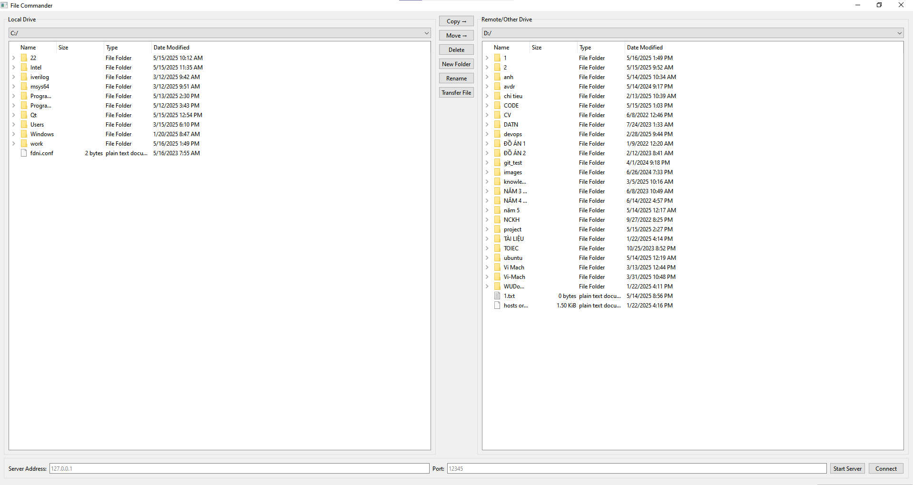

# File Commander

A simple manage file on disk C and D on PC.

## Features
1. Copy file
2. Delete file
3. Create new foler
4. Move file
5. Rename file
5. Transfer file use TCP (*.json, *.txt, *.png, *.jpg, *.jpeg)  

## Architect source
FileCommander/ \
├── src/ \
│   ├── FileManager.{h,cpp}  # manage file local \
│   ├── TcpClient.{h,cpp}    # process connect client \
│   ├── TcpServer.{h,cpp}    # process connect server \
│   ├── MainWindow.{h,cpp}   # UI \
│   └── main.cpp \
├── ui/ \
│   └── mainwindow.ui        # Qt Designer UI file \
├── CMakeLists.txt           # config to build \
├── image.png \
└── README.md

## Require System
- Qt 6.5 or later
- Visual Studio Code
- Qt Extension Pack for VS Code
- CMake
- A C++ Compiler (such as MinGW)

Follow: https://madhawapolkotuwa.medium.com/how-to-build-a-qt-application-using-visual-studio-code-0ba1781c6c3d and video https://youtu.be/j2Gfkrajb1M

## Setup enviroment
### Refer:
Make in windown: install GNU
http://gnuwin32.sourceforge.net/downlinks/make.php \
Qt open source minor: https://download.qt.io/static/mirrorlist/

## How to use feature transer file
1. Input port -> button "Start Server"
2. Input IP and port -> button "Connect" (port same to "Start Server")
3. Select file must transfer -> button "Transfer file" -> Chose folder save file.

## Reference documents
### Video
1. TCP/IP Communication:
https://www.youtube.com/watch?v=vFzRiW9OBmk&list=PLh0cogPqXcJMwB5xyLE2cpp39DcSQ1lY6&index=5

### Documents
1. QTcpServer: https://doc.qt.io/qt-6/qtcpserver.html 
2. QTcpSocket: https://doc.qt.io/qt-6/qtcpsocket.html
3. Build Qt Application on vscode: https://madhawapolkotuwa.medium.com/how-to-build-a-qt-application-using-visual-studio-code-0ba1781c6c3d and video 